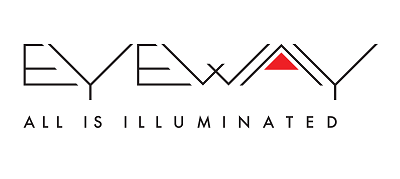

# C++ Distilled: Language Focus
2018-04-12: Our 6th user group meeting.

## Contents:
- [News, Updates, GTC Trip Report](CoreCppNewsUpdatesApr18.pdf), Michael Gopshtein (PDF)
- [C4GC: Concurrency](C4GC_concurrency.pdf) (Core C++ C++ Core Guidelines Corner), Dima Danilov (PDF)
- [Moving to C++17: personal experience](Cpp17-porting.pdf), Yair Friedman
- [Template Metaprogramming is Fun](TMP-is-fun.pdf), Sasha Goldshtein (PDF, [Code](CoreCPPTMP.cpp))

We are grateful to the sponsors of our meeting:  

  

    

