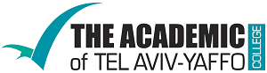

# Chill C++ @ MTA (TLV)
2019-07-30: Get some cool C++ for our July meetup in Tel-Aviv.

## Contents:
- [Welcome notes](201907_News+Updates+Intro), Adi Shavit
- [Writing ISO C++ Committee Papers](WG21-Papers.pdf), Yehezkel Bernat
- [The Affine Combination Math Challenge](The_Affine_Math_Challenge_and_operator+_for_class_Point.pdf), Amir Kirsh
- Smart Dispatch OR Winning The Race With Your Compiler, Inbal Levi

We are grateful to the sponsors of this meeting:  

  

