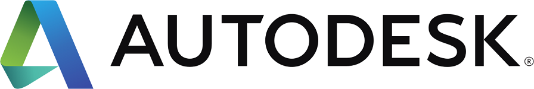

# Rothschild C++ TLV
2019-09-25: Rothschild C++ TLV

## Contents:
- Welcome notes, Adi Shavit
- [CppCon 2019 Trip Report](CppCon_2019_Trip_Report.pdf), Max Raskin
- Timeout support in legacy code using std::async, Artemy Vysotsky
- [Slicing in the Standard Library](Slicing_in_the_standard_library.pdf), Amir Kirsh

We are grateful to the host and the sponsor of this meeting:  

  

