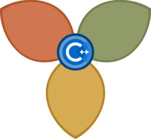

# Core C++ User Group Meetup Material

 

## Presentations and Materials

Slides, presentations and reference material from our meetings.  
Note that not all presentation slides are optimized for reading without the accompanying talk.

**2020**
- [Core C++ marches on! - Online Event](2020-04-35_Core_C++_marches_on!) 5 May 2020
- [Core C++ in Cyberspace! - Online Event](2020-03-37_Core_C++_in_Cyberspace_Online) 6 Apr 2020
- [Core C++20 Celebration](2020-02-26_Core_C++20_Celebration) 26 Feb 2020
- [Deep Winter Instacore C++](2020-01-28_Deep_Winter_Instacore_C++) 28 Jan 2020

**2019**  
- [Solstice Season Core C++](2019-12-24_Solstice_Season_Core_C++) 24 Dec 2019
- [Year 3 Kickoff: Probabilistic Data Structures, IoT and More!](2019-11-27_Probabilistic_Data_Structures_IoT_and_More) 27 Nov 2019
- [Core C++ Octoberfest](2019-10-24_Core_C++_Octoberfest) 24 Oct 2019
- [Rothschild C++ TLV](2019-09-25_Rothschild-C++-TLV) 25 Sep 2019
- [End summer with C++!](2019-08-29_Summer_CoreC++_2019) 29 Aug 2019
- [Chill C++ @ MTA (TLV)](2019-07-30_Chill-C++@MTA) 30 Jul 2019
- [Post Core C++ 2019 Meetup](2019-06-27_Post_Core_C++_2019) 27 Jun 2019
- [Distributed JLM/TLV C++ Meetup!](2019-03-28_Distributed_TLV_JLM) 28 Mar 2019
- [Core C++ @ MTA (TLV)](2019-02-19_Core_C++@MTA) 19 Feb 2019
- [C++ and Internet of Things :: IoT++](2019-01-17_C++and-Internet-of-Things_IoT++) 17 Jan 2019

**2018**  
- [C++ Everywhere](2018-12-20_C++-Everywhere) 20 Dec 2018
- [The Fast and the Furious C++](2018-11-27_FastFurious) 27 Nov 2018
- [Distributed C++ Meetup](2018-10-25_Distributed) 25 Oct 2018
- [Sweet C++20](2018-09-17_Sweet-C++) 17 Sep 2018
- [Core C++ @ TLV](2018-08-18_Core-C++TLV) 16 Aug 2018
- [Cool the Heat with Cool C++](2018-07-17_Cool-the-Heat-with-Cool-C++) 17 July 2018
- [Core Sea++ TLV](2018-07-03_Core-Sea++TLV) 3 July 2018
- [Lightning Storm](2018-06-28_Lightening-Storm) 28 June 2018
- [Practical C++ with Asio and Variant](2018-05-28_Practical-C++Asio-Variant) 28 May 2018
- [C++ Distilled: Language Focus](2018-04-12_C++-Distilled) 12 Apr 2018
- [SIMD, Span And Salami](2018-03-15_SIMD-Span-and-Salami) 15 Mar 2018
- [Hard Core C++](2018-02-22_Hard-Core-C++) 22 Feb 2018
- [Spectre And More](2018-01-29_Spectre-And-More) 19 Jan 2018

**2017**  
- [End of Year Inspirations](2017-12-28_End-Of-Year-Inspirations) 28 Dec 2017
- [Kick-Off Meeting](2017-11-30_Kick-Off-Meeting) 30 Nov 2017

## Find Us

- [Meetup](https://meetup.com/CoreCpp)
- [GitHub](https://github.com/CoreCppIL)
- [YouTube](https://www.youtube.com/channel/UCE14XYFaK1fDTnOTqlOFrrQ)
- [Slack](https://cpplang.slack.com/messages/C7UFRMFBP)
- [Facebook](https://facebook.com/corecpp)
- [Twitter](https://twitter.com/corecpp)

## Sponsor Us
- [Sponsorship Prospectus](https://corecppil.github.io/Prospectus/Sponsors.html)  

## Contact Us
- [Adi Shavit](mailto:adishavit@gmail.com) :: [Twitter](https://twitter.com/adishavit)
- [Michael Gopshtein](mailto:mgopshtein@gmail.com) :: [Twitter](https://twitter.com/michael_gop)
- [Inbal Levi](mailto:sinbal2l@gmail.com) :: [Twitter](https://twitter.com/Inbal_l)

## Code of Conduct
Core C++ abides by the [Berlin Code of Conduct](http://berlincodeofconduct.org/).

## We Want Your Talk!
We'd like *you* to present at Core C++!  
Wanna give a talk, or perhaps lead some other type of session, at a future Core C++ meet-up?
Great! Thanks! We're a product of the community, so we need people from all backgrounds to take their turn at the front.
Traditional talks - of all sorts of lengths - are always welcome, but we're also interested in different format and activities (discussions, games, workshops etc).

Please fill in [**this form**](https://forms.gle/uWPUXDrE3R6agsRq6) to get the ball rolling!
